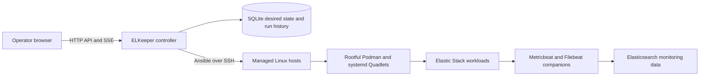

# ELKeeper

ELKeeper is a browser-based control plane for deploying and operating Elastic
Stack workloads on Linux hosts with Ansible and rootful Podman.

It provides an operator-focused alternative for environments that need
multi-host Elastic Stack orchestration without adopting Kubernetes. The
controller packages the React console, FastAPI API, Ansible runtime, playbooks,
and static assets into one container image.

> [!WARNING]
> ELKeeper is currently a development preview. It performs privileged host and
> workload operations. Evaluate it in an isolated environment, review every
> playbook, and place the controller behind HTTPS before using real credentials.

## Capabilities

- Enroll Linux hosts through an existing controller key or a one-time password.
- Validate SSH reachability, install the controller key, and manage legacy
  `known_hosts` entries.
- Initialize and de-initialize controller-owned Podman host resources.
- Configure shared or dedicated data and user network interfaces.
- Stage multiple workload additions, resource changes, and detaches, then apply
  them as one rollback-capable batch.
- Deploy Elasticsearch master, hot, warm, machine learning, ingest, and
  coordinating workloads.
- Deploy Kibana, Fleet Server, Elastic Agent, and Logstash workloads.
- Detect role-port collisions before deployment.
- Track workload image versions and perform guarded rolling upgrades.
- Collect workload metrics and controller-managed Filebeat log streams.
- Display cluster health, host telemetry, topology, endpoints, and tracked run
  output in the web console.
- Encrypt controller-managed cluster secrets and audit reveal/copy access.

## Architecture



Browsers communicate only with the FastAPI controller. Managed hosts are
reached through controller-owned SSH credentials. Podman uses its rootful Unix
socket; ELKeeper does not expose a Podman TCP listener.

## Module Boundaries

ELKeeper is a modular monolith. `app.main` is the application assembly and
compatibility surface; new domain behavior belongs in an owning module rather
than in a route page or the controller entry point.

| Module | Owns | Public entry points |
| --- | --- | --- |
| `platform` | lifecycle, SQLite, migrations, authentication, security, audit, runs | `app.modules.platform` |
| `orchestration` | typed SSH, Podman, Elasticsearch, and remote-file adapters | `app.modules.orchestration` |
| `hosts` and `controller_identity` | host inventory, enrollment, SSH identity lifecycle | `app.modules.hosts`, `app.modules.controller_identity` |
| `clusters` | cluster inventory, membership, NIC and provider policy | `app.modules.clusters` |
| `workloads` | assignments, resources, batches, topology, managed cleanup | `app.modules.workloads` |
| `versions` | registry discovery, image cache, download-only, guarded upgrades | `app.modules.versions` |
| `observability` | bounded telemetry, Podman tunnels, dashboard/runtime projections | `app.modules.observability` |
| `secrets` and `certificates` | masked metadata, audited reveal, certificate planning | `app.modules.secrets`, `app.modules.certificates` |
| `maintenance` | plans, locks, recovery, execution, persistence | `app.modules.maintenance` |

Modules expose public contracts from their package root, `contracts.py`,
`repository.py`, `service.py`, or an HTTP router builder. Other modules must
not import private implementation files or write another module's tables
directly. Route and table ownership are declared in
`app/refactor_ownership.py` and enforced by the boundary tools.

### Adding A Module Slice

1. Define public DTOs and a service/repository contract in the owning module.
2. Keep SQL and remote mutation inside that module's repository or adapter.
3. Inject cross-module providers from `app.main`; do not import `app.main`.
4. Add module unit and HTTP integration tests before moving a compatibility
   route or helper.
5. Run the strict ownership checks and preserve response, run-ID, SSE, audit,
   and redaction contracts.

See [AGENTS.md](AGENTS.md) for the complete module map, named test profiles,
and live-controller release rules.

## Technology

- Python 3.13, FastAPI, Pydantic, SQLite, and cryptography
- Ansible Core with `containers.podman` and `ansible.posix`
- React 18, TypeScript, Vite, Elastic EUI, TanStack Query, ECharts, and xterm.js
- Rootful Podman, systemd Quadlets, Metricbeat, and Filebeat

## Requirements

Controller host:

- A current Linux distribution
- Podman 5 or later
- Network access to the Elastic container registry, unless images are preloaded
- An SSH private key and writable `known_hosts` file for managed nodes

Managed hosts:

- A supported systemd-based Linux distribution
- Root SSH access during enrollment
- Podman-compatible kernel and storage
- Static addresses for the selected cluster interfaces

## Quick Start

Clone the repository and create local runtime paths:

```bash
git clone git@github.com:dennis-au/ELKeeper.git
cd ELKeeper
cp .env.example .env
mkdir -p data config playbooks
touch managed_nodes_known_hosts
chmod 600 managed_nodes_known_hosts
```

Create or select an SSH key for managed nodes, then set the absolute key and
`known_hosts` paths in `.env`. Replace every placeholder secret before starting
the controller.

Build the single controller image:

```bash
podman build -t localhost/elkeeper:dev -f Containerfile .
```

Load the runtime paths from `.env`, then run it with persistent state:

```bash
set -a
. ./.env
set +a

podman run -d --name elastic-control-plane --restart unless-stopped \
  --security-opt no-new-privileges \
  -p 8080:8080 \
  --env-file .env \
  -e APP_DATA_DIR=/var/lib/elastic-control \
  -e APP_CONFIG_DIR=/config \
  -e SSH_KEY_PATH=/run/secrets/managed_nodes_ssh_key \
  -e SSH_KNOWN_HOSTS_PATH=/run/secrets/managed_nodes_known_hosts \
  -v "$PWD/data:/var/lib/elastic-control:Z" \
  -v "$PWD/config:/config:Z" \
  -v "$PWD/playbooks:/opt/elastic-control/custom-playbooks:Z" \
  -v "$SSH_KEY_FILE:/run/secrets/managed_nodes_ssh_key:ro,Z" \
  -v "$SSH_KNOWN_HOSTS_FILE:/run/secrets/managed_nodes_known_hosts:ro,Z" \
  localhost/elkeeper:dev
```

Open `http://localhost:8080` and sign in with the administrator credentials from
`.env`. For access from another machine, terminate TLS at a trusted reverse
proxy and restrict network access to the controller.

`compose.yaml` is included for environments with a compatible Compose provider.
Direct `podman build` and `podman run` remain the reference packaging model.

## Persistent Data

The controller keeps state outside its image:

| Container path | Purpose |
| --- | --- |
| `/var/lib/elastic-control` | SQLite database, run state, inventories, and temporary variables |
| `/config` | Persistent controller configuration |
| `/run/secrets/managed_nodes_ssh_key` | Read-only legacy or bootstrap SSH key |
| `/run/secrets/managed_nodes_known_hosts` | Managed SSH host-key records |

Back up `data/control.db` before replacing the controller or testing database
migrations. Never publish `.env`, `data/`, `config/`, SSH keys, host inventories,
run logs, or backup files.

## Development

Backend tests:

```bash
python -m unittest discover -s tests -q
```

Frontend tests and build:

```bash
cd frontend
npm ci
npm test
npm run typecheck
npm run build
```

Check an Ansible playbook before use:

```bash
ansible-playbook --syntax-check ansible/playbooks/cluster-reconcile.yml
```

Run all strict refactor ownership checks from the repository root:

```bash
python tools/check_refactor_boundaries.py --strict
python tools/check_table_ownership.py --strict
```

## Project Status

The current implementation is suitable for development and lab evaluation. Key
future priorities include continuous desired-state reconciliation,
Elasticsearch-aware shutdown and scale-down, snapshot and restore management,
failure-domain placement, RBAC, and certificate rotation.

See [wishlist.md](wishlist.md) for the prioritized development roadmap.

## Security

Read [SECURITY.md](SECURITY.md) before reporting a vulnerability. Do not include
passwords, private keys, tokens, certificates, database files, or live host
addresses in an issue.

## License

No open-source license has been selected yet. Public availability of this
repository does not grant permission to copy, modify, or redistribute the code.

ELKeeper is an independent project and is not affiliated with or endorsed by
Elastic. Elasticsearch, Kibana, Elastic Stack, and related names are trademarks
of their respective owners.
